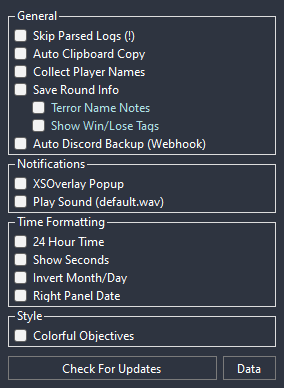
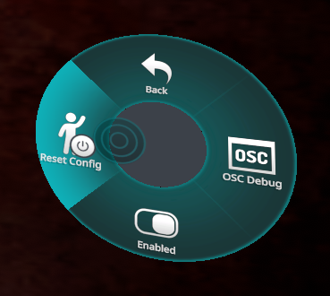

⚠️このリポジトリは非公式日本語翻訳フォークです。内容が古い可能性があります。 
本家: https://github.com/ChrisFeline/ToNSaveManager

  

  # Terrors of Nowhere: Save Manager
  ToNのセーブコードを追跡するシンプルなツールです。バックアップを忘れても、後でセーブコードを復元してプレイすることができます。
  また、セーブコードの履歴をローカル保存して使用することができます。

  # [ダウンロード](https://github.com/ChrisFeline/ToNSaveManager/releases/latest/download/ToNSaveManager.zip "GitHubから最新バージョンをダウンロード")
  
  ### [Discord サーバー](https://discord.gg/Anpm8d3fPD) • [VRChatグループ](https://vrc.group/TONSM.0849)

  [リリースを見る](https://github.com/ChrisFeline/ToNSaveManager/releases "現在と過去のリリースの一覧を表示") • 
  [セーブガイド](https://terror.moe/save "初心者向けのセーブとロードの方法") • 
  [よくある質問](../Docs/Localization/ja-JP/FAQ.md)

  

# 🛠️ 機能と説明
- ログを自動的に解析して、セーブコードを検出します。
- ツールの実行中は、新しいセーブコードを検出します。
- 検出されたセーブコードはローカル保存されるため、VRChatが時間の経過とともにログを削除しても、セーブコードの履歴がローカルに保存されるため、安全です。

## 設定ウィンドウ
- `アップデートを確認` 新しいリリースがないか確認します。
- `自動でクリップボードにコピー` 新しいセーブコードを自動的にクリップボードにコピーします。
- `プレイヤー名を収集` セーブコードにインスタンス内のプレイヤーをメモします。
- `XSOverlay ポップアップ` 新しいセーブコードの検出時にXSOverlayのポップアップ通知を表示します。
- `音声を再生` 新しいセーブコードの検出時に通知音を再生します。
  - ダブルクリックでカスタムオーディオファイルを選択します。(.wavファイルのみ)
  - 右クリックで'default.wav'に戻します。
- `カラフルなアイテム`'アイテム'ウィンドウ内のアイテムをゲーム内のアイテムの色に対応する色で表示します。
- `自動でDiscordにバックアップ` **Discord webhook**を使用して、プレイ中に新しいセーブコードのバックアップを自動的にDiscordチャンネルにアップロードします。
- `OSCパラメータを送信` OSCを使用してアバターパラメータを送信します。詳しくは[ドキュメント](#osc-documentation)を確認してください。
- `WebSocket API サーバー` 接続されたクライアントにリアルタイムのゲーム内イベントを送信するWebSocketサーバーを有効にします。詳しくは[**APIドキュメント**](../Docs/Localization/ja-JP/WebSocketAPI.md)をご確認ください。
- `チャットボックスメッセージを送信`ToNの情報をVRChatのチャットボックスに送信します。 (待機時間のみ) - テンプレートをさらにカスタマイズするには[**テンプレートドキュメント**](../Docs/Localization/ja-JP/Templates.md)をご確認ください。

プレビュー画像

  

## 右クリックメニュー
- ### Log Dates (左パネル)
  * `インポート` 独自のセーブコードを入力して、コレクションに保存できます。
  * `名前を変更` コレクションの名前を変更できます。
  * `削除` データベースからログ全体を削除します。
- ### Save Codes (右パネル)
  * `追加` 選択したセーブコードを、好きな名前をつけたカスタムコレクションに保存またはお気に入り登録できます。
  * `メモを編集` 選択したセーブコードにメモを添付できます。
  * `バックアップ` **自動でDiscordにバックアップ**が設定されている場合、強制的にバックアップをアップロードします。
  * `削除` データベースから選択したセーブコードのみを削除します。
  
## アイテムウィンドウ
- このウィンドウにはアンロック可能なリストが表示され、進捗状況を確認することができます。アンロックしたものをクリックするだけです。

## OSC ドキュメント
- [**パラメータ名と型**](../Docs/Localization/ja-JP/OSC/OSC_Parameters.md)
- [**ラウンドタイプ値**](../Docs/Localization/ja-JP/OSC/OSC_RoundType.md)

OSCトラブルシューティング

パラメータが正しく受信されない場合は、OSCをリセットしてみてください。

<b>ラジアルメニュー</b>から、<b>OSC</b>を開き、<b>設定をリセット</b>をクリックします。

# 🌐 利用可能な翻訳
> [`Localization/CONTRIBUTE.md`](../Localization/CONTRIBUTE.md)をチェックして、Save Managerをあなたの言語に翻訳してください。

| 言語 | 翻訳者 |
| -------- | ---------- |
| English/英語  | -          |
| Spanish/スペイン語  | -          |
| Japanese/日本語 | [github.com/nomlasvrc](https://github.com/nomlasvrc)   [twitter.com/nomlasvrc](https://twitter.com/nomlasvrc) |
| German/ドイツ語   | [github.com/sageyx2002](https://github.com/sageyx2002) |
| Traditional Chinese/繁体字中国語  | [github.com/XoF-eLtTiL](https://github.com/XoF-eLtTiL) |
| Simplified Chinese/簡体字中国語  | [github.com/Fallen-ice](https://github.com/Fallen-ice) |
| Italian/イタリア語  | [github.com/TheIceDragonz](https://github.com/TheIceDragonz) |

# 📫 連絡先:
> 日本語翻訳に関する提案や問題は[のむらす](https://twitter.com/nomlasvrc)にお願いします！X(旧Twitter)でDMするか、Save ManagerのDiscord サーバー([discord.gg/Anpm8d3fPD](https://discord.gg/Anpm8d3fPD))でメンションしてください！

> ### <u>このツールに関する提案や問題をBeyondに送らないでください！</u>
> 本家リポジトリの[Issues](https://github.com/ChrisFeline/ToNSaveManager/issues)タブで問題や提案を報告できます。または、以下の連絡先を参照してください。

> - **Discord:** [@Kittenji](https://discord.gg/Anpm8d3fPD) 
> - **VRChat:** [Kittenji](https://vrchat.com/home/user/usr_7ac745b8-e50e-4c9c-95e5-8e7e3bcde682)
> ## 私が[Terrors of Nowhere](https://vrchat.com/home/world/wrld_a61cdabe-1218-4287-9ffc-2a4d1414e5bd)をプレイしているのを見かけたら声をかけてね！
> 
  

# ❤️ サポート:
> If you want to support the development of this tool you can [Buy Me A Coffee ♥](https://ko-fi.com/kittenji) on ko-fi.