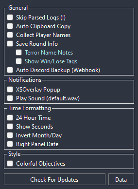
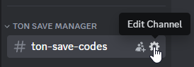
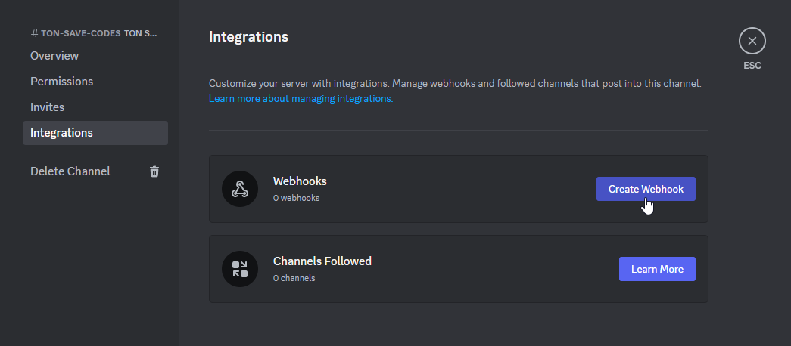
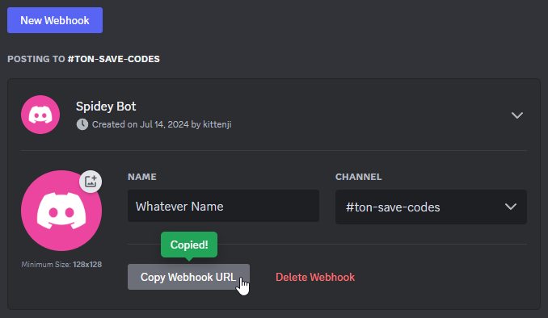

  

  # Terrors of Nowhere: セーブマネージャー
  セーブコードを記録しておくシンプルなツールで、バックアップをし忘れてもコードを復元してプレイできます。また、コード履歴をローカル保存して後で使用できます。  
  これは[ChrisFeline/ToNSaveManager](https://github.com/ChrisFeline/ToNSaveManager)の非公式日本語翻訳フォークです。翻訳について[のむらす](https://twitter.com/nomlasvrc)はいかなる保証もできません。

  # [ダウンロード](https://github.com/ChrisFeline/ToNSaveManager/releases/latest/download/ToNSaveManager.zip "GitHubから直接最新バージョンをダウンロードする")

  [リリース](https://github.com/ChrisFeline/ToNSaveManager/releases "現在と過去のリリース") • 
  [初心者向けセーブガイド](https://terror.moe/save "初心者向けのセーブ方法") • 
  [使い方](#-faq)

  

# 🛠️ 機能と説明
- ログを自動的にスキャンしてセーブコードを探します。
- ツールの実行中は、プレイ中に新しいコードが検出されます。
- 以前に検出されたセーブ コードはローカル データベースに保存されるため、VRChat が時間の経過とともにログを削除した場合でも、セーブ コードの履歴はローカルに安全に残ります。

### 設定画面
- `Auto Clipboard Copy` 新しいセーブコードを自動的にクリップボードにコピーします。
- `Collect Player Names` セーブコードには、インスタンスにいたプレイヤーが表示されます。
- `XSOverlay Popup` 新しいセーブコードが検出されると、XSOverlayの通知が表示されます。
- `Play Sound` セーブ時に通知音声を再生します。
  - ダブルクリックして任意の音声ファイルを選択します。（wavファイルのみ）
  - 右クリックして音声ファイルを「default.wav」に戻します。
- `Colorful Objectives` 「Objectives」ウィンドウ内のアイテムをゲーム内のアイテムと同じ色で表示します。
- `Auto Discord Backup` [discord webhook](##how-to-properly-configure-automatic-discord-backup-using-webhooks)を使用して、プレイ中に新しいコードのバックアップを Discord チャンネルに自動的にアップロードします。
- `Check For Updates` クリックすると、本家の github リポジトリで新しいリリースがチェックされ、自動更新を試すように求められます。

プレビュー

  

### メニュー
- ### ログの日付 (左パネル)
  * `Import` セーブコードをインポートして保存します。
  * `Rename` 名前を変更します。
  * `Delete` データベースからログの日付全体を削除します。
- ### セーブコード (右パネル)
  * `Add to` このコードを、任意の名前で別のカスタム コレクションに保存したり、お気に入りに追加したりできます。
  * `Edit Note` このセーブコードにメモを添付できます。
  * `Backup` 設定で`Auto Discord Backup`が構成されている場合、Discord へのバックアップのアップロードを強制します。
  * `Delete` 指定したセーブコードをデータベースから削除します。
  
### Objectives ウィンドウ
- このウィンドウには、進捗状況を追跡するために確認できるロック解除可能な項目のリストが表示されます。すでにロック解除したものをクリックするだけです。

# 📋 よくある質問

> ## 使い方を教えてください。
> 1. [<u>最新リリース</u>](https://github.com/ChrisFeline/ToNSaveManager/releases/latest)から、`ToNSaveManager.zip`をダウンロードしてください。
> 2. zipファイルの中身を任意のフォルダーに解凍します。
> 3. `ToNSaveManager.exe`を開いてください。
> 4. 左側のログの日付を選択し、右側のセーブコードのいずれかをクリックします。
> 5. コードがクリップボードに保存されたので、VRChat 上で入力欄にコードを貼り付けます。

> ## 機能をリクエストするにはどこに連絡すればいいでしょうか？
> 新しい機能や変更を提案したい場合は、[本家レポジトリ](https://github.com/ChrisFeline/ToNSaveManager)でIssueを開くか、[Toren Discord](https://discord.gg/bus-to-nowhere)で@**Kittenji**として連絡してください。

> ## どのように機能しますか？
> ToNは定期的にあなたの進行状況のスナップショットを VRChat ログ ファイルに保存します。
> 
> 最初に、プログラムは`%LOCALAPPDATA%Low\VRChat\VRChat`にあるログをスキャンし、ログに残っている過去のセーブコードを回復します。その後、プレイ中に新しいコードを検出し続けます。

> ## ToNをプレイしたのに何も表示されません。
> **ログの出力**が無効になっている可能性があります。
> クイック メニューを開いて設定を開き、一番下までスクロールしてログの出力を有効にしてください。
> 

> 
<b>画像を表示</b>

> 
  

> 

> ## Webhook を使用して自動 Discord バックアップを適切に構成するにはどうすればよいですか？
> Discord の Webhook URL を設定すると、コードが Discord チャンネルに自動的にアップロードされます。
>
> - Discord サーバー上のアップロードしたいチャンネルに移動します。
> - 「**チャンネルの編集**」をクリックし、「**連携サービス**」に移動します。
> - 「**ウェブフックを作成**」をクリックします。名前とプロフィール写真を指定できます。
> - Webhook URL をコピーします。
> - このアプリで設定画面を開きます。
> - `Auto Discord Backup`を有効にすると、テキスト入力ポップアップが表示されます。
> - **save**をクリックします。
> 
> NOTE: If you want to test this functionality, you can right click on a save entry then click **Backup**. If everything is right, save will be uploaded to the discord channel.
> 

> 
<b>Discordのスクリーンショットを表示</b>

> 
  

> 
  

> 
  

> 

> ## なぜexeファイルが100MBを超えているのですか？
> exe には、プログラムを実行するために必要な .NET ランタイムが内包されています。 dotnetの公開に`--self-contained true -p:PublishSingleFile=true`というコマンド ライン引数を使用しました。  
> これにより、ファイルのサイズは大きくなりますが、以前の .NET インストールに依存せずにプログラムが独立して実行されるようになります。
>
> これにより、このプログラムをダウンロードするユーザーは、.NET ランタイム フレームワークを自分でダウンロードする必要がなくなります。また、ユーザーによる追加操作なしですぐに実行できます。
>
> プログラムは GitHub Actions を使用してソースからコンパイルされ、[ワー​​クフロー ファイル](https://github.com/ChrisFeline/ToNSaveManager/blob/a0d503b02fe25fde1b36ca9807756f1830c8e7a8/.github/workflows/dotnet-desktop.yml#L46C45-L46C45)で完全な引数を確認できます。

> ## これはVRChatの利用規約に違反しますか？
> - 簡潔に言うと、答えは No です。
>
> これは、VRChat が Local APPDATA フォルダーに書き込むローカル プレーン テキスト ファイルを使用する外部ツールです。
> ゲームを一切変更または改変しないため、これらのファイルを読み取ることは許可されています。
> **MODやチートではありません。**

> ### このツールに関する提案や問題について、Beyond にメッセージを送信しないでください。
> 本家レポジトリの[Issues](https://github.com/ChrisFeline/ToNSaveManager/issues) タブで問題や提案を報告できます。または、以下の連絡先情報を参照してください。

# 📫 連絡先
> **Discord:** [@Kittenji](https://discord.gg/HGk2RQX) 
> **VRChat:** [Kittenji](https://vrchat.com/home/user/usr_7ac745b8-e50e-4c9c-95e5-8e7e3bcde682)
> ## 私が[Terrors of Nowhere](https://vrchat.com/home/world/wrld_a61cdabe-1218-4287-9ffc-2a4d1414e5bd)をプレイしているのを見かけたら声をかけてください！
> 
  

# ❤️ サポート
> このツールの開発をサポートしたい場合は、ko-fi で[Coffee ♥](https://ko-fi.com/kittenji)を購入できます。